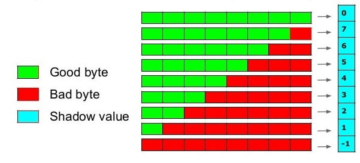

# Санитайзеры

## ASAN

Address sanitizer. Ловит ошибки связанные с адресацией:
* use after free
* heap buffer overflow
* stack buffer overflow
* use after scope
* memory leak
* ...

Сильно снижает производительность (~2x). Проверяет, что все обращения к памяти валидные.

Для этого вводится ShadowMemory -- область памяти, хранящая информацию про основную память.

Теперь с помощью ShadowMemmory мы можем понимать состояние памяти по конкретному адресу.
Если попадаем в красную зону, значит обращение к памяти было невалидным. 

Добавим свой аллокатор, который будет:
* выравнивать все до 8 байт
* добавлять красную буфферную зону вокруг каждого выделения памяти:

  
Памяти, показанной выше будет соответсвовать shadow bytes : `0xff`, `0x05`, `0xff`.

Shadow для адреса `x` будет храниться по адресу `x` / 8. 

Мы не можем использовать нулевые адреса, поэтому добавим оффсет.

Shadow для адреса `x` будет храниться по адресу `x` / 8 + offset.

Тут можно посмотреть подробнее: https://godbolt.org/z/dsP1e7Mx3

