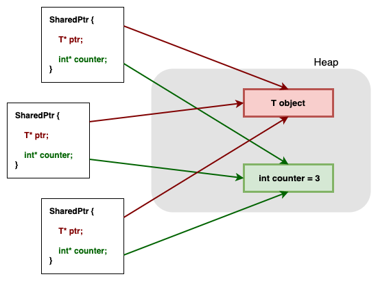
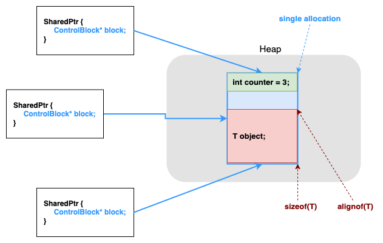

# Как решать `smart-ptrs`?

## Общие моменты

1) Обязательно запускайте все под санитайзером, в том числе Leak Sanitizer (который ловит утечки памяти). На MacOS LSAN может не работать на компиляторе по умолчанию (Apple Clang), рекомендуется поставить homebrew clang (`brew install llvm`) и собирать им.

2) Вы можете найти реализацию умных указателей во многих источниках, и это хорошо, если вы сможете в них *разобраться*. Слепое копирование без понимания всегда заметно, и мы обязательно будем выявлять такие случаи :)

## `UniquePtr`

Самый простой умный указатель - `std::unique_ptr`. Все, что он делает - каким-то образом принимает указатель на аллоцированную память и удаляет ее в своем деструкторе. Таким образом, `unique_ptr` принимает *владение* над объектом, поэтому логично, что у него нет конструктора копирования и копирующего оператора присваивания.

Простейшую реализацию `unique_ptr` наверняка писали на 1 курсе, наша будет отличаться в нескольких моментах. Во-первых, указатель может быть не только на единичный элемент, но и на целый массив, поэтому существует также реализация `unique_ptr<T[]>`. Почему для нее нужна отдельная специализация? Что в ней будет отличаться по сравнению с основной?

Во-вторых, объект, которым владеет умный указатель, может требовать более сложной семантики удаления, чем `operator delete` (какие можно привести примеры?), поэтому у `unique_ptr` есть второй шаблонный параметр `Deleter` - функтор, который нужно позвать в деструкторе указателя. Важно знать, что вообще говоря звать его на `nullptr` некорректно (хотя `delete nullptr;` и безопасен). У `std::unique_ptr` есть дефолтный делитер, вам также нужно его реализовать вместо `Slug`.Как эффективно хранить делитер? (можно посмотреть на тесты на размер `UniquePtr`).

Третье - бывают также указатели `void*`, и их может быть удобно захватывать в `UniquePtr`. Зачем такое может быть нужно? Где возникнут проблемы с `UniquePtr<void>` в обычной реализации?

Дополнительно можно обсудить:
* Почему в `std::default_delete<T>` можно встретить `static_assert(sizeof(T) > 0)` и `static_assert(!is_void_v<T>)`?
* В какие методы `UniquePtr` стоит добавить `noexcept` и почему? Как работает `std::vector<std::unique_ptr>`?
* Рассказать, что можно в качестве делитера хранить ссылку. К каким эффектам это приводит? Можно посмотреть прошлогодние тесты.

## `SharedPtr`

### Первый подход

Семантика `shared_ptr` всем известна - этот класс кроме указателя на объект хранит также счетчик ссылок на него и удаляет всех, когда счетчик обнуляется. Как реализовать такое поведение в простейшем виде с помощью поля `int*`? Что будет происходить в конструкторе копирования, в конструкторе перемещения?

.

Какой размер у такого `SharedPtr`? Как добиться `sizeof(SharedPtr<T>) == sizeof(void*)` с помощью контрольного блока?


### `MakeShared`. Второй вариант контрольного блока

Какие есть способы "заполнить" `SharedPtr`? Глобально три:

1) Передать сырой указатель в конструкторе либо в `Reset`
2) Скопировать из другого `SharedPtr`, при этом счетчик ссылок должен увеличиться
3) Создать объект с нуля и сразу получить на него `SharedPtr` с помощью `MakeShared`.

Рассмотрим третий способ подробнее. Сколько будет выполнено аллокаций в наивной реализации `MakeShared<T>` через уже написанный контрольный блок? Ответ: 2 (без учета аллокаций внутри создаваемого объекта типа `T`,на что повлиять нельзя).

Попробуем добиться одной аллокации. Ключевая предпосылка - создаваемый объект типа `T` удаляться объект будет самим `SharedPtr` и никем больше.

Выделим память под объект и под счетчик *одной* аллокацией. Вопросы, которые здесь требуют ответа:

* Как определить нужный размер и выравнивание памяти под объект и под блок?
* Как разделить выделение памяти и вызов конструктора на этой памяти?
* Как правильно передать аргументы в конструктор типа `T` через `MakeShared<T>` и конструктор блока?
* Как отличать блок первого типа (с указателем и счетчиком) от блока второго типа (с объектом и счетчиком)?

Ответы на эти вопросы (кроме, может быть, последнего) - на прошлых лекциях и семинарах :)

Теперь можно вместе ответить на вопрос, почему в `std::shared_ptr` нет метода `release`.



### Aliasing constructor. Почему нужно все-таки два указателя

Рассмотрим [ситуацию](aliasing-ctor.cpp) - имеется структура, доступная через `shared_ptr`, и нужно передать в функцию указатель на одно из ее полей. Функция не знает, что передаваемый объект является полем некой структуры, при этом ее аргумент не должен удалиться до ее окончания. Как обеспечить тут корректную работу с памятью?

Чтобы в данном примере сохранить корректность и избежать аллокаций, нужна поддержка со стороны `shared_ptr` - а именно, нужно уметь разделять, *какой памятью объект владеет* и *на какую указывает*. Что есть что в нашем примере?

Для поддержки такой семантики существует aliasing constructor
```
template <typename Y>
SharedPtr(const SharedPtr<Y>& other, T* ptr);
```

Что такое `Y` и `T` в нашем примере?

Еще вопросы для обсуждения:

* Куда сохранить `ptr`? Почему плохо держать его в контрольном блоке? (А что если понадобится создать умные указатели на несколько разных полей?)

* Как удалять объект из указателя, созданного через aliasing - ведь мы не знаем про тип исходного объекта? Тут можно посмотреть [пример type erasure](type-erasure.cpp) и поговорить про самоудаление объектов и почему это корректно.


### Советы по дизайну

Мы имеем два варианта контрольного блока (с указателем и с объектом), как избежать бранчинга в основном классе? Используем наследование и полиморфизм: создадим базовый класс, и два наследника для двух типов блоков. Что нужно от каждого блока?

* Инкрементировать счетчик ссылок
* Декрементировать счетчик ссылок. (Что происходит при достижении нуля?)

Отличается ли эта логика у контрольных блоков? Отличие только в семантике удаления. Давайте эту семантику и переопределим в классах-наследниках.

Что делает при обнулении ссылок первый блок и второй блок? А как должен удаляться сам блок? Как это сделать проще всего?

Общее:
* Постарайтесь нигде в коде класса `SharedPtr` не обращаться к полям контрольного блока напрямую.

## `WeakPtr`

Рассматриваем [стандартный пример]() циклических ссылок на `SharedPtr`-ы. В чем проблема? Почему бы не заменить один из указателей на сырой?

Основные моменты из семантики `WeakPtr`:

* Не препятствует удалению объекта, на который смотрит. Как и сырой указатель.
* Позволяет узнавать, удален ли уже объект. Поэтому лучше сырого указателя.
* Можно получить только из `SharedPtr` (см. конструкторы)

Как `WeakPtr` может узнавать, что объект уже удален? Так как он может быть создан только из `SharedPtr`, можно дать ему доступ к контрольному блоку, в котором есть счетчик ссылок.

Однако теперь нужно гарантировать, что сам контрольный блок не удалится при удалении объекта, которым владеют указатели - то есть, *лайфтаймы контрольного блока и объекта будут разными*.

Теперь нужно поддерживать два счетчика - для "сильных" ссылок, которые соответствуют `SharedPtr`, и для "слабых" ссылок из `WeakPtr`-ов. Что должно происходить при обнулении каждого счетчика?

Общее:
* Точную семантику методов уточняйте на cppreference
* `WeakPtr` также имеет умеет быть aliasing
* Как и в `SharedPtr`, постарайтесь не обращаться к полям контрольного блока напрямую. Заведите методы

## `SharedFromThis`


## `IntrusivePtr`

